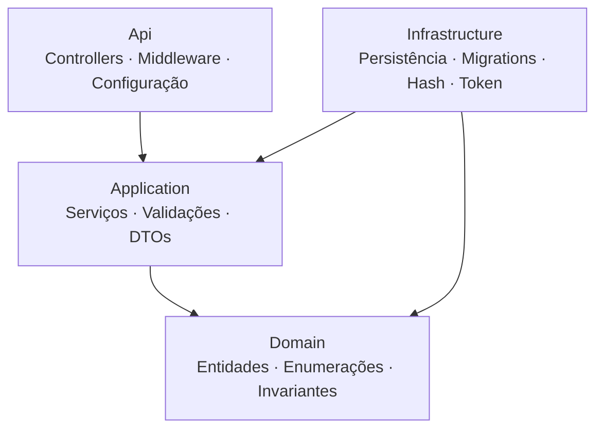

# Domus Finance

Sistema web de controle de gastos residenciais: cadastro das pessoas de um
domicílio, registro das transações de cada uma e consolidação de totais
individuais e da casa, com acesso protegido por autenticação.

O escopo é enxuto por decisão de projeto. A prioridade está em separação de
responsabilidades, validação consistente, testes nas regras críticas e um
ambiente que sobe inteiro com um comando.

---

## Execução

**Pré-requisitos:** Docker e Docker Compose. Nada mais precisa estar instalado.

```bash
git clone https://github.com/mateusnriy/domus-finance.git
cd domus-finance
cp .env.example .env
```

Defina **`JWT_CHAVE`** no `.env` com no mínimo 32 caracteres — é o único campo
obrigatório. A API se recusa a iniciar sem ele.

```bash
openssl rand -base64 48    # sugestão para gerar o valor
```

As demais variáveis podem ficar em branco; nesse caso valem os padrões
documentados no próprio `.env.example`.

```bash
docker compose up --build
```

Um comando sobe os três serviços. As migrations são aplicadas na inicialização e
os dados de demonstração entram quando o banco está vazio.

**Persistência.** Os dados ficam em um volume nomeado e sobrevivem ao
encerramento. `docker compose down` preserva o volume; `down -v` apaga tudo.

**Portas ocupadas.** Defina `WEB_PORT`, `API_PORT` ou `DB_PORT` no `.env`. Ao
mudar as portas do cliente ou da API, ajuste também `FRONTEND_ORIGIN` e
`VITE_API_URL`, explicadas no `.env.example`.

---

## Acesso

| Recurso | Endereço |
|---------|----------|
| Cliente web | http://localhost:5173 |
| Documentação da API (Swagger) | http://localhost:8080/swagger |
| API | http://localhost:8080/api |
| Verificação de saúde | http://localhost:8080/health |

Conta de demonstração criada na primeira execução: **`demo@domusfinance.local`**
/ **`Demo@1234`**. O banco nasce com três moradores e quatro lançamentos,
incluindo um menor de idade e uma pessoa sem transações — os casos de borda da
tela de totais.

No Swagger, autentique em `POST /api/auth/login`, copie o `token` da resposta e
informe-o no botão **Authorize**. Os endpoints de negócio respondem 401 sem
token.

---

## Stack

| Camada | Tecnologia |
|--------|-----------|
| **Backend** | .NET 8 (ASP.NET Core Web API), C# |
| Persistência | PostgreSQL 16, Entity Framework Core 8 |
| Validação e segurança | FluentValidation, JWT Bearer, BCrypt |
| Testes de backend | xUnit, FluentAssertions, SQLite em memória |
| **Frontend** | React 18, TypeScript, Vite |
| Estilo | Tailwind CSS v4 (tokens via `@theme`) |
| Formulários e HTTP | React Hook Form, axios |
| Testes de frontend | Vitest, Testing Library, axe-core |
| **Infraestrutura** | Docker, Docker Compose, Nginx |

Sem biblioteca de UI, de estado global ou de gráficos: o design system é próprio
e as barras de proporção são CSS.

---

## Funcionalidades

| Funcionalidade | Onde verificar |
|----------------|----------------|
| Cadastrar, editar e excluir pessoas | `/pessoas` |
| Cadastrar, editar e excluir transações | `/transacoes` |
| Filtrar por pessoa, tipo, categoria e período | `/transacoes` → barra de filtros |
| Totais por pessoa, total geral e despesas por categoria | `/totais` |
| Registro, login, sessão restaurada e logout | `/login` e painel lateral |
| Aviso de impacto antes de excluir uma pessoa | `/pessoas` → excluir com lançamentos |

O rastreamento completo entre requisitos, regras de negócio e código está em
[`docs/01-escopo-e-requisitos.md`](./docs/01-escopo-e-requisitos.md); os
identificadores (`RF`, `RNF`, `RN`) aparecem como comentários na implementação.

**O backend é a fonte da verdade: nenhuma regra depende do cliente.** O frontend
espelha algumas apenas para dar retorno imediato. Duas regras que costumam
passar despercebidas: menor de 18 anos registra despesas normalmente, apenas
receita é recusada (422); e a existência da pessoa é verificada antes da
maioridade, então pessoa inexistente devolve 404 mesmo com tipo receita.

---

## API

| Método | Rota | Acesso | Descrição |
|--------|------|:------:|-----------|
| `POST` | `/api/auth/registrar` | público | Cria uma conta |
| `POST` | `/api/auth/login` | público | Autentica e devolve o token |
| `GET` | `/api/auth/eu` | protegido | Dados do usuário da sessão |
| `GET` | `/health` | público | Disponibilidade da API |
| `POST` | `/api/pessoas` | protegido | Cadastra pessoa |
| `GET` | `/api/pessoas` | protegido | Lista com a contagem de transações |
| `PUT` | `/api/pessoas/{id}` | protegido | Edita nome e idade |
| `DELETE` | `/api/pessoas/{id}` | protegido | Exclui pessoa e suas transações |
| `POST` | `/api/transacoes` | protegido | Cadastra transação |
| `GET` | `/api/transacoes` | protegido | Lista com filtros combináveis |
| `PUT` | `/api/transacoes/{id}` | protegido | Edita transação |
| `DELETE` | `/api/transacoes/{id}` | protegido | Exclui transação |
| `GET` | `/api/totais` | protegido | Consolidado por pessoa, geral e por categoria |

Filtros aceitos em `GET /api/transacoes`: `pessoaId`, `tipo`, `categoria`,
`dataInicio` e `dataFim`, combináveis entre si.

---

## Arquitetura

Camadas (Layered / N-tier), com a regra de dependência apontando para o domínio.



São quatro projetos, não quatro pastas: assim a regra de dependência é
verificada pelo compilador, não pela disciplina de quem escreve.
`DomusFinance.Domain` não referencia nenhum outro. Os controllers são finos e as
regras ficam testáveis sem subir a API.

No cliente, o fluxo é `Componente → Hook → Service → apiClient → API`. Nenhum
componente chama o axios diretamente. Dois interceptadores concentram a sessão:
um anexa o token, o outro descarta a sessão ao receber 401.

Camadas, pipeline, autenticação e visão de containers em detalhe:
[`docs/05-arquitetura.md`](./docs/05-arquitetura.md).

---

## Decisões técnicas

- **`decimal` para valores monetários**, nunca ponto flutuante binário. O valor
  é sempre positivo; o sentido financeiro vem do tipo.
- **Integridade reforçada no banco.** Toda regra verificável em dados também
  existe como restrição: faixa de idade, valor positivo, domínios fechados,
  e-mail único, exclusão em cascata.
- **Segredo obrigatório na inicialização** e `ClockSkew` zerado na validação do
  token: falhar cedo é preferível a operar com assinatura fraca ou token além do
  prazo.
- **Prevenção de enumeração de contas.** E-mail inexistente e senha incorreta
  devolvem resposta idêntica e em tempo equivalente.
- **Token no armazenamento local — trade-off assumido.** Em produção, a
  recomendação seria cookie inacessível a scripts; o custo (proteção contra
  requisição forjada, CORS com credenciais, ajuste de domínio) seria
  desproporcional a este escopo.

Justificativas completas em
[`docs/05-arquitetura.md`](./docs/05-arquitetura.md).

---

## Testes

```bash
dotnet test backend/DomusFinance.sln     # 44 testes
npm --prefix frontend test               # 47 testes
```

**Backend.** Domínio, serviços de pessoas, transações, totais e autenticação.
Cobrem a maioridade e sua precedência sobre o 404, a exclusão em cascata
verificada no banco, a precisão decimal nas somas e a resposta idêntica para
credencial inválida. Usam SQLite em memória e não exigem Docker — por ser
relacional, cascata e restrições valem de verdade.

**Frontend.** Autenticação, pessoas, transações, totais, acessibilidade e
operação por teclado. Cobrem as regras espelhadas no cliente e os quatro estados
de cada tela. A interface é consultada por papel, rótulo e texto; a rede é
mockada na camada de serviço; o axe audita as quatro telas.

---

## Estrutura

```
domus-finance/
├── docker-compose.yml
├── .env.example                  # template de variáveis, sem valores funcionais
├── docs/                         # documentação de engenharia
├── backend/
│   ├── src/
│   │   ├── DomusFinance.Domain/          # entidades, enums, invariantes
│   │   ├── DomusFinance.Application/     # serviços, DTOs, validações, contratos
│   │   ├── DomusFinance.Infrastructure/  # EF Core, migrations, hash, token
│   │   └── DomusFinance.Api/             # controllers, middleware, configuração
│   └── tests/DomusFinance.Tests/
└── frontend/
    ├── nginx.conf                # fallback de rota para a SPA
    └── src/
        ├── types/                # contratos da API
        ├── lib/                  # cliente HTTP, formatação, tradução de erros
        ├── auth/                 # contexto de sessão e rota protegida
        ├── components/           # design system
        ├── layout/               # painel lateral e cabeçalho de tela
        ├── features/             # auth, pessoas, transacoes, totais
        └── testes/
```

---

## Documentação

Em [`docs/`](./docs/): visão geral, escopo e requisitos, casos de uso, diagrama
de classes, modelo de banco de dados, arquitetura, design brief e
[uso de IA no projeto](./docs/07-uso-de-ia.md).
