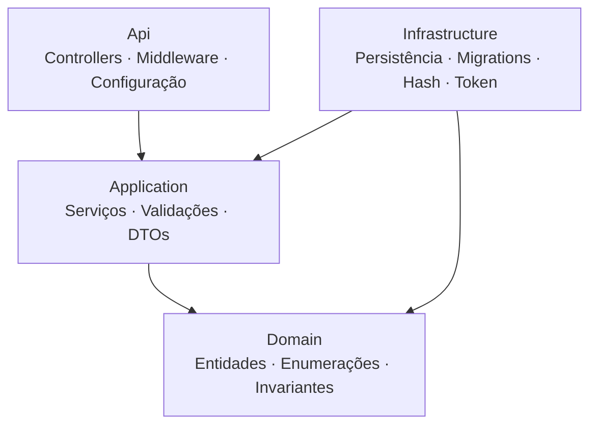
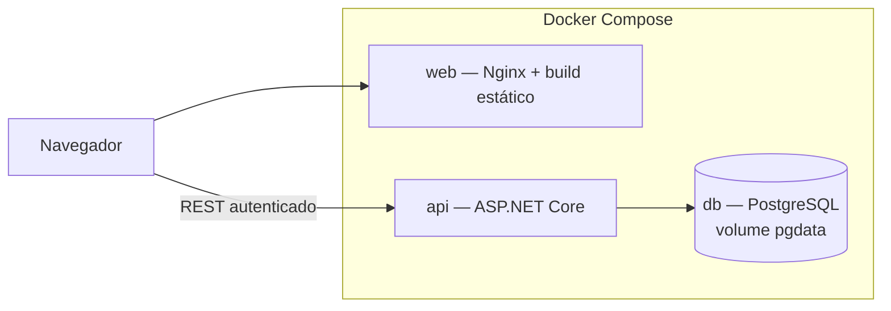

# Domus Finance

Sistema web de controle de gastos residenciais: cadastro das pessoas de um
domicílio, registro das transações financeiras de cada uma e consolidação de
totais individuais e da casa, com acesso protegido por autenticação.

O nome vem de *domus*, "lar" em latim. A proposta é responder, a qualquer
momento, a uma pergunta que a maioria das residências acompanha mal: **quem
recebeu, quem gastou e como está o saldo da casa.**

O escopo é enxuto por decisão de projeto. A prioridade está em separação de
responsabilidades, validação consistente, cobertura de testes nas regras
críticas e um ambiente que sobe inteiro com um comando.

---

## Sumário

- [Execução](#execução)
- [Endereços e credenciais](#endereços-e-credenciais)
- [Stack](#stack)
- [Entrega dos requisitos](#entrega-dos-requisitos)
- [Regras de negócio e onde elas vivem](#regras-de-negócio-e-onde-elas-vivem)
- [Arquitetura](#arquitetura)
- [API](#api)
- [Decisões técnicas](#decisões-técnicas)
- [Testes](#testes)
- [Estrutura do repositório](#estrutura-do-repositório)
- [Documentação de engenharia](#documentação-de-engenharia)
- [Além do escopo mínimo](#além-do-escopo-mínimo)
- [Evolução futura](#evolução-futura)

---

## Execução

### Pré-requisitos

Apenas **Docker** e **Docker Compose**. Nada de instalar .NET, Node ou
PostgreSQL na máquina.

Para desenvolvimento fora dos containers, também .NET 8 SDK e Node 22.

### Passo a passo

```bash
git clone https://github.com/mateusnriy/domus-finance.git
cd domus-finance
cp .env.example .env
```

Abra o `.env` e defina **`JWT_CHAVE`** com no mínimo 32 caracteres — é o único
campo obrigatório. A API se recusa a iniciar sem ele, com mensagem explícita:
falhar cedo é preferível a subir com assinatura enfraquecida.

```bash
openssl rand -base64 48    # sugestão para gerar o valor
```

As demais variáveis podem ficar em branco; nesse caso valem os padrões
documentados no próprio `.env.example`. O arquivo é um template de instruções e
não contém nenhum valor funcional — o `.env` efetivo é ignorado pelo Git.

```bash
docker compose up --build
```

Um comando sobe os três serviços. As migrations são aplicadas na inicialização,
com nova tentativa enquanto o banco não aceita conexões, e os dados de
demonstração são inseridos quando o banco está vazio.

### Persistência

Os dados ficam em um volume nomeado e sobrevivem ao encerramento:

```bash
docker compose down     # sem -v, preserva o volume
docker compose up       # os dados continuam lá
```

`docker compose down -v` apaga o volume. Use apenas para recomeçar do zero.

### Portas ocupadas

Defina `WEB_PORT`, `API_PORT` ou `DB_PORT` no `.env`. Ao mudar as portas do
cliente ou da API, ajuste também `FRONTEND_ORIGIN` e `VITE_API_URL` — a primeira
é a origem liberada no CORS, a segunda é a base da API gravada no bundle do
cliente. O `.env.example` explica cada uma.

---

## Endereços e credenciais

| Recurso | Endereço |
|---------|----------|
| Cliente web | http://localhost:5173 |
| Documentação da API (Swagger) | http://localhost:8080/swagger |
| API | http://localhost:8080/api |
| Verificação de saúde | http://localhost:8080/health |

**Conta de demonstração**, criada automaticamente na primeira execução:

| Campo | Valor |
|-------|-------|
| E-mail | `demo@domusfinance.local` |
| Senha | `Demo@1234` |

O banco também nasce com três moradores e quatro lançamentos de exemplo,
incluindo um menor de idade e uma pessoa sem transações — os dois casos de borda
que a tela de totais precisa exibir corretamente.

Para explorar pela documentação da API: autentique em `POST /api/auth/login`,
copie o `token` da resposta e informe-o no botão **Authorize**. Os endpoints de
negócio respondem 401 sem token.

---

## Stack

| Camada | Tecnologia |
|--------|-----------|
| **Backend** | .NET 8 (ASP.NET Core Web API), C# |
| Persistência | PostgreSQL 16, Entity Framework Core 8 |
| Validação | FluentValidation |
| Autenticação | JWT Bearer, BCrypt |
| Testes de backend | xUnit, FluentAssertions, SQLite em memória |
| **Frontend** | React 18, TypeScript, Vite |
| Estilo | Tailwind CSS v4 (tokens via `@theme`) |
| Formulários e HTTP | React Hook Form, axios |
| Testes de frontend | Vitest, Testing Library, axe-core |
| Servidor estático | Nginx |
| **Infraestrutura** | Docker, Docker Compose |

Sem biblioteca de UI, de estado global ou de gráficos: o design system é próprio
e as barras de proporção são CSS.

---

## Entrega dos requisitos

Os identificadores abaixo são os de [`docs/01-escopo-e-requisitos.md`](./docs/01-escopo-e-requisitos.md)
e aparecem como comentários no código, criando rastreabilidade entre a
documentação e a implementação.

### Núcleo obrigatório

| ID | Requisito | Situação | Onde verificar |
|----|-----------|----------|----------------|
| RF01 | Cadastrar pessoa | ✅ | `/pessoas` → "+ Adicionar" · `POST /api/pessoas` |
| RF02 | Listar pessoas com contagem de transações | ✅ | `/pessoas` · `GET /api/pessoas` |
| RF03 | Excluir pessoa em cascata | ✅ | `/pessoas` → ícone de exclusão · `DELETE /api/pessoas/{id}` |
| RF04 | Cadastrar transação | ✅ | `/transacoes` → "+ Adicionar" · `POST /api/transacoes` |
| RF05 | Listar transações com a pessoa associada | ✅ | `/transacoes` · `GET /api/transacoes` |
| RF06 | Totais por pessoa | ✅ | `/totais` → tabela "Por pessoa" · `GET /api/totais` |
| RF07 | Total geral | ✅ | `/totais` → cartões-resumo e linha de total |

### Controle de acesso

| ID | Requisito | Situação | Onde verificar |
|----|-----------|----------|----------------|
| RF10 | Registrar usuário | ✅ | `/login` → aba "Registrar" · `POST /api/auth/registrar` |
| RF11 | Autenticar usuário | ✅ | `/login` · `POST /api/auth/login` |
| RF12 | Encerrar sessão | ✅ | "Sair", na base do painel lateral |
| RF13 | Consultar usuário autenticado | ✅ | `GET /api/auth/eu` (restaura a sessão ao recarregar) |
| RF14 | Proteger endpoints | ✅ | Qualquer chamada de negócio sem token responde 401 |

### Usabilidade e operação

| ID | Requisito | Situação | Onde verificar |
|----|-----------|----------|----------------|
| RF09 | Validar formulários no cliente | ✅ | Envio com campos vazios ou inválidos |
| RF15 | Exibir impacto da exclusão | ✅ | Excluir uma pessoa com lançamentos |
| RF16 | Indicador visual de proporção | ✅ | Barras nas linhas de `/totais` |
| RF17 | Verificação de saúde | ✅ | `GET /health` |

### Extensões de escopo (v3)

| ID | Requisito | Situação | Onde verificar |
|----|-----------|----------|----------------|
| RF18 | Editar pessoa | ✅ | `/pessoas` → ícone de edição |
| RF19 | Editar transação | ✅ | `/transacoes` → ícone de edição |
| RF20 | Excluir transação | ✅ | `/transacoes` → ícone de exclusão |
| RF23 | Resumo de despesas por categoria | ✅ | `/totais` → "Despesas por categoria" |
| RF08 | Filtrar por pessoa, tipo, categoria e período | ✅ | `/transacoes` → barra de filtros |

### Requisitos não funcionais

| ID | Requisito | Como foi atendido |
|----|-----------|-------------------|
| RNF01 | Persistência | Volume nomeado `pgdata`; verificado com `down` seguido de `up` |
| RNF02 | Reprodutibilidade | `docker compose up --build` sobe banco, API e cliente |
| RNF03 | Qualidade de código | Quatro projetos com dependência verificada pelo compilador; lint e build sem avisos |
| RNF04 | Documentação | Swagger interativo, este README e `docs/` |
| RNF05 | Confiabilidade | Todas as regras no servidor; o cliente apenas as espelha para retorno imediato |
| RNF06 | Tratamento de erros | Middleware único traduz exceção em status: 400, 401, 404, 409, 422 |
| RNF07 | Usabilidade | Carregando, erro, vazio e conteúdo tratados em cada tela, com teste para cada estado |
| RNF08 | Manutenibilidade | 91 testes automatizados sobre as regras críticas |
| RNF09 | Portabilidade | Execução em containers, independente do sistema operacional |
| RNF10 | Segurança de entrada | Validação com FluentValidation e CORS restrito à origem do cliente |
| RNF11 | Segurança de credenciais | BCrypt com salt por senha; nenhuma resposta expõe hash |
| RNF12 | Gestão de sessão | Token com validade de 8 horas; 401 descarta a sessão e retorna ao login |
| RNF13 | Acessibilidade | WCAG 2.1 AA revisado por tela, com auditoria automática por axe |
| RNF14 | Responsividade | Layout de 320px a 1920px, sem rolagem horizontal |

---

## Regras de negócio e onde elas vivem

O backend é a fonte da verdade: **nenhuma regra depende do cliente.** O que o
frontend faz é espelhar algumas delas para dar retorno imediato, sem jamais
substituir a validação do servidor.

| ID | Regra | Servidor | Cliente | Banco |
|----|-------|:--------:|:-------:|:-----:|
| RN02 | Transação exige pessoa existente | ✅ | — | chave estrangeira |
| RN03 | Menor de 18 anos registra apenas despesas | ✅ | espelhada | — |
| RN04 | Tipo é domínio fechado | ✅ | — | restrição |
| RN05 | Excluir pessoa exclui suas transações | ✅ | aviso prévio | cascata |
| RN06 | Valor maior que zero | ✅ | espelhada | restrição |
| RN07 | Saldo pode ser negativo | ✅ | cor por sinal | — |
| RN08 | Total geral é a soma das linhas | ✅ | — | — |
| RN09 | Nome até 150 caracteres; idade de 0 a 130 | ✅ | espelhada | restrição |
| RN11 | E-mail único, normalizado em minúsculas | ✅ | — | índice único |
| RN12 | Senha com no mínimo 8 caracteres, só como hash | ✅ | espelhada | — |
| RN13 | Falha de autenticação com mensagem genérica | ✅ | espelhada | — |
| RN14 | Token expira em 8 horas | ✅ | descarta em 401 | — |
| RN17 | Impacto da exclusão informado antes de confirmar | ✅ | modal | — |
| RN18 | Data obrigatória e não futura | ✅ | espelhada | — |
| RN19 | Categoria opcional, de domínio fechado | ✅ | espelhada | restrição |
| RN20 | Editar revalida as regras da criação | ✅ | espelhada | — |
| RN21 | Maioridade avaliada no momento do registro | ✅ | — | — |

Duas sutilezas que valem registro:

- **RN03 restringe o tipo, não bloqueia a pessoa.** Um menor de idade registra
  despesas normalmente; apenas receita é recusada, com 422 e mensagem própria.
- **A existência da pessoa é verificada antes da maioridade.** Pessoa
  inexistente devolve 404 mesmo quando o tipo enviado é receita — a precedência
  dos erros é deliberada e coberta por teste.

---

## Arquitetura

**Camadas (Layered / N-tier)**, com a regra de dependência apontando para o
domínio.



`DomusFinance.Domain` não referencia nenhum outro projeto — a regra é verificada
pelo compilador, não pela disciplina de quem escreve. Os controllers são finos:
recebem, chamam o serviço, devolvem. As regras ficam testáveis sem subir a API.

**Inversão de dependência na segurança:** as interfaces de hash e de geração de
token pertencem a `Application`; as implementações, a `Infrastructure`. A lógica
de autenticação não conhece BCrypt nem a biblioteca de JWT.

### Containers



O navegador fala com os dois serviços: carrega a interface do `web` e chama a
`api` diretamente. Por isso `VITE_API_URL` é o endereço público da API, e não o
nome do serviço na rede interna do Compose.

### Cliente

Organização por funcionalidade, com o fluxo
`Componente → Hook → Service → apiClient → API`. Nenhum componente chama o axios
diretamente, e os services não conhecem React. Dois interceptadores concentram a
sessão: um anexa o token; o outro, ao receber 401, descarta a sessão e volta ao
login — sem que cada tela precise tratar isso.

---

## API

| Método | Rota | Acesso | Descrição |
|--------|------|:------:|-----------|
| `POST` | `/api/auth/registrar` | público | Cria uma conta |
| `POST` | `/api/auth/login` | público | Autentica e devolve o token |
| `GET` | `/api/auth/eu` | protegido | Dados do usuário da sessão |
| `GET` | `/health` | público | Disponibilidade da API |
| `POST` | `/api/pessoas` | protegido | Cadastra pessoa |
| `GET` | `/api/pessoas` | protegido | Lista com a contagem de transações |
| `PUT` | `/api/pessoas/{id}` | protegido | Edita nome e idade |
| `DELETE` | `/api/pessoas/{id}` | protegido | Exclui pessoa e suas transações |
| `POST` | `/api/transacoes` | protegido | Cadastra transação |
| `GET` | `/api/transacoes` | protegido | Lista com filtros combináveis |
| `PUT` | `/api/transacoes/{id}` | protegido | Edita transação |
| `DELETE` | `/api/transacoes/{id}` | protegido | Exclui transação |
| `GET` | `/api/totais` | protegido | Consolidado por pessoa, geral e por categoria |

A exigência de autenticação é aplicada no controller, com liberação explícita
dos endpoints públicos. Negar por padrão é preferível: esquecer uma configuração
resulta em endpoint protegido demais, nunca desprotegido.

Filtros aceitos em `GET /api/transacoes`: `pessoaId`, `tipo`, `categoria`,
`dataInicio` e `dataFim`, combináveis entre si.

---

## Decisões técnicas

**Arquitetura em quatro projetos, não em pastas.** Projetos separados tornam a
regra de dependência verificável pelo compilador. Uma regra que depende de
convenção se perde no primeiro atalho.

**Regras de negócio no servidor.** A API está correta quando chamada
diretamente, sem cliente algum. O frontend espelha algumas regras apenas para
dar retorno imediato ao usuário.

**Integridade reforçada no banco.** Cada regra verificável em dados também
existe como restrição: idade entre 0 e 130, valor maior que zero, tipo e
categoria como domínios fechados, e-mail único, exclusão em cascata. Uma regra
que vive só em código se perde no primeiro acesso direto ao banco.

**`decimal` para valores monetários**, nunca ponto flutuante binário. O valor é
sempre positivo; o sentido financeiro vem do tipo, o que elimina ambiguidade no
saldo e evita somar sinais trocados.

**Soma em memória, não agregação no banco.** O provedor SQLite usado nos testes
recusa agregação sobre `decimal`. Somar em C# roda igual nos dois bancos e
mantém a aritmética decimal exata — o custo é irrelevante neste volume.

**Totais projetados a partir de `Pessoas`, não de `Transacoes`.** Quem não tem
lançamento precisa aparecer zerado em vez de sumir do resultado (RF06).

**Data do fato separada da data de registro.** `data` é informada pelo usuário e
alimenta os filtros por período; `criado_em` é o instante do registro. Uma
despesa lançada com atraso tem as duas diferentes.

**Prevenção de enumeração de contas.** E-mail inexistente e senha incorreta
devolvem resposta idêntica *e* em tempo equivalente: o caminho do e-mail
inexistente executa uma verificação BCrypt descartável. Sem ela, a diferença no
tempo de resposta revelaria quais e-mails existem.

**`ClockSkew` zerado** na validação do token, removendo a tolerância padrão de
cinco minutos que faria o token sobreviver além do prazo declarado.

**Segredo obrigatório na inicialização.** Chave ausente ou com menos de 32
caracteres derruba a aplicação com mensagem clara, em vez de deixá-la no ar com
assinatura fraca.

**Sem framework de identidade completo.** Ele traria confirmação de e-mail,
segundo fator, bloqueio por tentativas e várias tabelas não utilizadas. Para uma
única entidade de usuário, uma implementação enxuta é mais legível — sem que
isso signifique criptografia própria: o hash continua sendo uma biblioteca
consagrada.

**Token no armazenamento local — trade-off assumido.** Expõe o token a script
malicioso. A alternativa mais segura seria cookie inacessível a scripts, que
exigiria proteção contra requisição forjada, credenciais no CORS e ajuste de
domínio entre containers — custo desproporcional ao escopo. A mitigação é a
escapagem automática do React. Em produção, a recomendação seria o cookie
restrito. Detalhamento em [`docs/05-arquitetura.md`](./docs/05-arquitetura.md).

**Base da API fixada em tempo de build no cliente.** Arquivo estático servido
por Nginx não lê variável de ambiente em execução, então `VITE_API_URL` entra
como argumento de build. O Nginx trata o restante como SPA, devolvendo
`index.html` para as rotas do React Router.

**Frontend sem estado global além da sessão.** Cada tela busca seus dados pelo
Hook da sua feature e recarrega pela API após cada alteração, em vez de deduzir
o resultado localmente. Os totais vêm sempre do servidor.

---

## Testes

```bash
dotnet test backend/DomusFinance.sln     # 44 testes
npm --prefix frontend test               # 47 testes
```

**Backend (44).** Domínio, serviços de pessoas, transações, totais e
autenticação. Cobrem a maioridade e sua precedência sobre o 404, a exclusão em
cascata verificada no banco, a precisão decimal nas somas, a pessoa sem
transações na consolidação e a resposta idêntica para credencial inválida.

Usam SQLite em memória e **não exigem Docker**. A escolha é deliberada: por ser
relacional, cascata e restrições de integridade valem de verdade, o que um
provedor em memória puro não garantiria.

**Frontend (47).** Distribuídos em seis arquivos: autenticação, pessoas,
transações, totais, acessibilidade e operação por teclado. Cobrem as regras
espelhadas no cliente (RN03, RN06, RN09, RN12, RN13, RN17, RN18, RN20) e os
quatro estados de cada tela.

Consultam a interface por papel, rótulo e texto — como o usuário a encontra —,
e não por classe ou estrutura interna. A rede é mockada na camada de serviço. A
auditoria de acessibilidade roda o axe sobre as quatro telas em múltiplos
estados, incluindo formulário e modal abertos.

```bash
npm --prefix frontend run lint     # sem avisos
npm --prefix frontend run build    # sem avisos
```

---

## Estrutura do repositório

```
domus-finance/
├── docker-compose.yml            # orquestração dos três serviços
├── .env.example                  # template de variáveis, sem valores funcionais
├── docs/                         # documentação de engenharia
├── backend/
│   ├── DomusFinance.sln
│   ├── Dockerfile
│   ├── src/
│   │   ├── DomusFinance.Domain/          # entidades, enums, invariantes
│   │   ├── DomusFinance.Application/     # serviços, DTOs, validações, contratos
│   │   ├── DomusFinance.Infrastructure/  # EF Core, migrations, hash, token
│   │   └── DomusFinance.Api/             # controllers, middleware, configuração
│   └── tests/
│       └── DomusFinance.Tests/
└── frontend/
    ├── Dockerfile
    ├── nginx.conf                # fallback de rota para a SPA
    └── src/
        ├── types/                # contratos da API
        ├── lib/                  # cliente HTTP, formatação, tradução de erros
        ├── auth/                 # contexto de sessão e rota protegida
        ├── components/           # design system
        ├── layout/               # painel lateral e cabeçalho de tela
        ├── features/             # auth, pessoas, transacoes, totais
        └── testes/
```

---

## Documentação de engenharia

Em [`docs/`](./docs/): visão geral, escopo e requisitos, casos de uso, diagrama
de classes, modelo de banco de dados, arquitetura e o design brief que orientou
a interface.

---

## Além do escopo mínimo

- **Edição e exclusão** de pessoas e transações, além do cadastro e da listagem
- **Categorias** de despesa e **resumo consolidado por categoria**
- **Filtros combináveis** por pessoa, tipo, categoria e período
- **Autenticação completa** com registro, sessão restaurada ao recarregar e
  proteção de rotas no cliente
- **Prevenção de enumeração de contas** com equalização do tempo de resposta
- **`ClockSkew` zerado** e falha de inicialização com segredo ausente ou curto
- **Acessibilidade tratada como requisito, não como revisão final:** navegação
  completa por teclado, gestão de foco no modal, campos associados a rótulo e
  erro, e auditoria automática com axe sobre as quatro telas
- **Design system próprio**, sem biblioteca de componentes
- **91 testes automatizados**, cobrindo as regras de negócio no servidor e as
  regras espelhadas e os estados de tela no cliente

---

## Evolução futura

Registrada como caminho natural, fora do escopo atual:

1. **Isolamento de dados por usuário**, com vínculo de propriedade nas entidades
2. **Renovação de token** com rotação, para sessões longas
3. **Papéis e permissões**, separando administração de consulta
4. **Cookie restrito com proteção contra requisição forjada**, substituindo o
   armazenamento local do token
5. **Recuperação de senha** por e-mail
