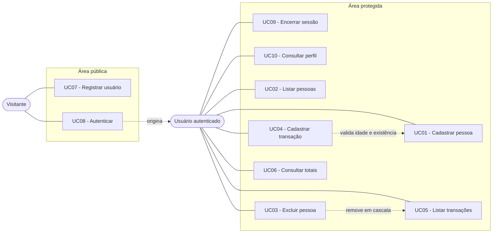
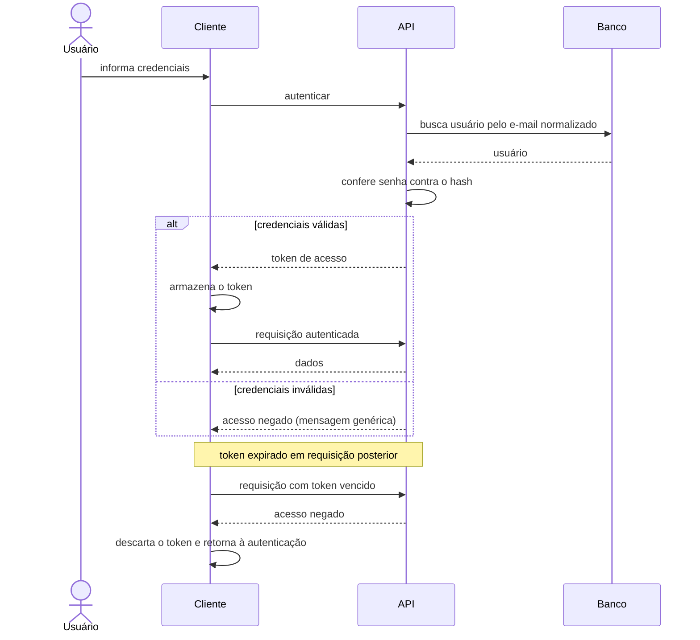

# 02 — Casos de Uso

## 1. Atores

| Ator | Descrição |
|------|-----------|
| **Visitante** | Não autenticado. Pode apenas registrar-se ou autenticar-se. |
| **Usuário autenticado** | Operador do sistema após autenticação. Executa todas as operações de negócio. |

Não há hierarquia de papéis: todo usuário autenticado possui as mesmas permissões (RN16).

## 2. Diagrama

## 3. Controle de acesso

### UC07 — Registrar usuário
**Ator:** Visitante · **Pré-condição:** nenhuma

**Fluxo principal**
1. O visitante informa nome, e-mail e senha.
2. O sistema valida o formato dos dados.
3. O sistema normaliza o e-mail e verifica se já está cadastrado.
4. O sistema gera o hash da senha e persiste o usuário.
5. O sistema retorna os dados do usuário, sem a senha.

**Fluxos de exceção**
- Dados inválidos: o sistema informa os erros de validação.
- E-mail já cadastrado: o sistema informa o conflito.

**Pós-condição:** usuário apto a autenticar-se.

### UC08 — Autenticar
**Ator:** Visitante · **Pré-condição:** usuário previamente registrado

**Fluxo principal**
1. O visitante informa e-mail e senha.
2. O sistema normaliza o e-mail e localiza o usuário.
3. O sistema confere a senha contra o hash armazenado.
4. O sistema emite um token de acesso com validade definida.
5. O sistema retorna o token e os dados do usuário.

**Fluxo de exceção**
- E-mail inexistente ou senha incorreta: o sistema retorna a mesma mensagem genérica em ambos os casos (RN13).

**Pós-condição:** cliente de posse de um token válido.

### UC09 — Encerrar sessão
**Ator:** Usuário autenticado

**Fluxo principal**
1. O usuário solicita a saída.
2. O cliente descarta o token armazenado.
3. O sistema apresenta a tela de autenticação.

**Observação:** o encerramento ocorre no cliente. Não há invalidação de token no servidor — decisão registrada no documento 05.

### UC10 — Consultar perfil
**Ator:** Usuário autenticado

**Fluxo principal**
1. O cliente envia o token de acesso.
2. O sistema valida o token e identifica o usuário.
3. O sistema retorna nome e e-mail.

**Fluxo de exceção**
- Token ausente, inválido ou expirado: acesso negado.

## 4. Domínio financeiro

> **Pré-condição comum a UC01–UC06:** usuário autenticado (RN15). Token ausente ou inválido resulta em acesso negado em qualquer um deles.

### UC01 — Cadastrar pessoa
**Fluxo principal**
1. O usuário informa nome e idade.
2. O sistema valida os dados.
3. O sistema gera o identificador e persiste.
4. O sistema retorna a pessoa criada.

**Fluxo de exceção:** dados inválidos resultam em erro de validação.

### UC02 — Listar pessoas
**Fluxo principal**
1. O usuário acessa a listagem.
2. O sistema retorna todas as pessoas ordenadas por nome, acompanhadas da quantidade de transações de cada uma (RN17).

### UC03 — Excluir pessoa
**Pré-condição:** a pessoa existe

**Fluxo principal**
1. O usuário solicita a exclusão.
2. O sistema informa quantas transações serão removidas em conjunto e solicita confirmação (RN17).
3. O usuário confirma.
4. O sistema exclui a pessoa e, em cascata, todas as suas transações (RN05).

**Fluxos de exceção**
- O usuário cancela: nenhuma alteração é realizada.
- A pessoa não existe: o sistema informa que o recurso não foi encontrado.

**Pós-condição:** pessoa e transações removidas de forma irreversível.

### UC04 — Cadastrar transação
**Pré-condição:** existe ao menos uma pessoa cadastrada

**Fluxo principal**
1. O usuário informa descrição, valor, tipo e pessoa.
2. O sistema valida os campos.
3. O sistema verifica se a pessoa existe (RN02).
4. O sistema verifica a regra de maioridade (RN03).
5. O sistema persiste e retorna a transação criada.

**Fluxos de exceção**
- Pessoa inexistente: recurso não encontrado.
- Pessoa menor de idade registrando receita: regra de negócio violada.
- Valor inválido ou campo obrigatório ausente: erro de validação.

**Precedência:** a existência da pessoa é verificada antes da regra de maioridade.

### UC05 — Listar transações
**Fluxo principal**
1. O usuário acessa a listagem, opcionalmente filtrando por pessoa e por tipo (RF08).
2. O sistema retorna as transações com os dados da pessoa associada.

### UC06 — Consultar totais
**Fluxo principal**
1. O sistema calcula, por pessoa, o total de receitas, despesas e o saldo (RN07), incluindo pessoas sem transações.
2. O sistema calcula o total geral (RN08).
3. O sistema retorna a consolidação.

## 5. Fluxo de sessão

