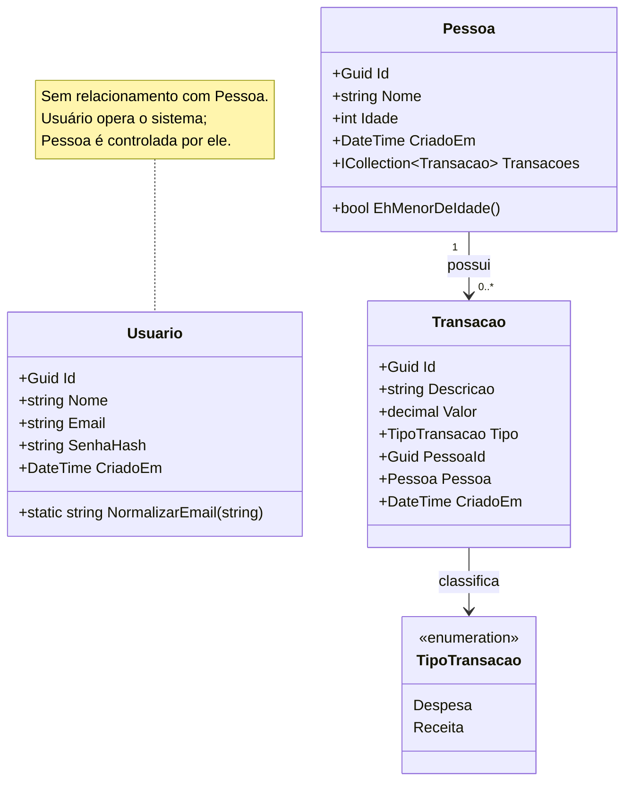

# 03 — Diagrama de Classes de Domínio

## 1. Diagrama

## 2. Separação entre Usuario e Pessoa

Decisão central do modelo, com justificativa explícita.

| | `Usuario` | `Pessoa` |
|---|-----------|----------|
| Papel | Opera o sistema | É controlada pelo sistema |
| Possui credenciais | Sim | Não |
| Possui transações | Não | Sim |
| Aparece nos totais | Não | Sim |
| Pode ser excluída | Não | Sim, em cascata |

**Por que não unificar as entidades:**

1. Nem todo morador controlado precisa acessar o sistema. Uma criança tem despesas registradas sem possuir credenciais.
2. Excluir uma pessoa apaga suas transações (RN05). Se pessoa fosse usuário, apagar um registro financeiro derrubaria uma conta de acesso.
3. Um usuário pode administrar as finanças de um domicílio sem fazer parte dele.

Manter as entidades independentes preserva a coerência: autenticação é preocupação de acesso, pessoa é preocupação de domínio financeiro. São eixos distintos.

Caso futuramente seja necessário vincular um usuário à sua pessoa correspondente, o caminho é uma chave estrangeira opcional, sem herança e sem tornar o vínculo obrigatório.

## 3. Descrição das classes

### Usuario
Operador do sistema.

| Membro | Descrição |
|--------|-----------|
| `Id` | Identificador único gerado automaticamente (RN01) |
| `Nome` | Nome de exibição, obrigatório |
| `Email` | Único no sistema, armazenado normalizado em minúsculas (RN11) |
| `SenhaHash` | Hash da senha com salt embutido; nunca exposto (RN12) |
| `CriadoEm` | Data de criação em UTC |
| `NormalizarEmail` | Método estático que centraliza a normalização, garantindo que registro e autenticação apliquem a mesma transformação |

O nome da propriedade `SenhaHash` — em vez de `Senha` — sinaliza no próprio código que ali nunca existe texto puro.

### Pessoa
Morador cujas finanças são controladas.

| Membro | Descrição |
|--------|-----------|
| `Id` | Identificador único gerado automaticamente (RN01) |
| `Nome` | Obrigatório, até 150 caracteres (RN09) |
| `Idade` | Inteiro entre 0 e 130 (RN09) |
| `CriadoEm` | Data de criação em UTC |
| `Transacoes` | Coleção de transações; base da exclusão em cascata (RN05) |
| `EhMenorDeIdade` | Encapsula a regra de maioridade (RN03) no domínio |

### Transacao
Movimentação financeira vinculada a uma pessoa.

| Membro | Descrição |
|--------|-----------|
| `Id` | Identificador único gerado automaticamente (RN01) |
| `Descricao` | Obrigatória, até 200 caracteres (RN10) |
| `Valor` | Decimal sempre positivo (RN06) |
| `Tipo` | Despesa ou receita (RN04) |
| `PessoaId` / `Pessoa` | Chave estrangeira e navegação; a pessoa deve existir (RN02) |
| `CriadoEm` | Data de criação em UTC |

O valor é sempre positivo: o sentido financeiro é determinado pelo tipo, nunca pelo sinal. Isso elimina ambiguidade no cálculo do saldo.

### TipoTransacao
Enumeração de domínio fechado (RN04). Evita valores livres e garante consistência em tempo de compilação e no banco.

## 4. Decisões de modelagem

| Decisão | Justificativa |
|---------|---------------|
| Regra de maioridade na entidade | Fica testável e próxima do dado que a origina |
| Normalização de e-mail como método estático | Garante regra idêntica em registro e autenticação |
| Entidades sem dependência de infraestrutura | O domínio não conhece persistência nem transporte |
| Propriedades com escrita privada | Impede a criação de entidades em estado inválido |
| Enumeração em vez de texto livre | Garante o domínio fechado em compilação e no banco |
| `Usuario` isolado de `Pessoa` | Separa acesso de domínio financeiro |