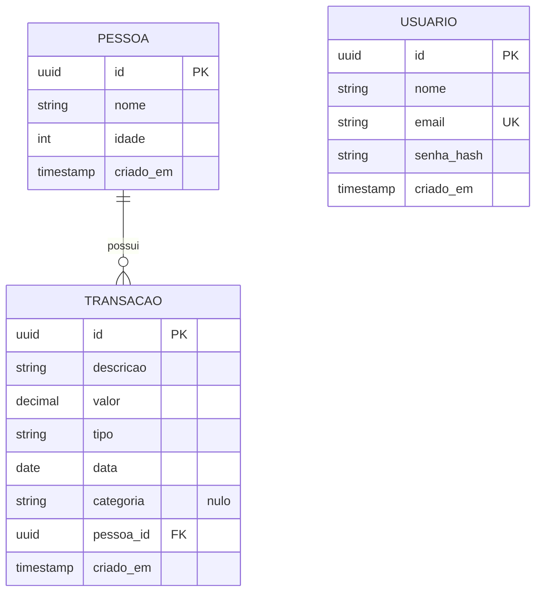

# 04 - Modelagem do Banco de Dados

Banco: **PostgreSQL 16**. Mapeamento: **Entity Framework Core 8** com migrations.

## 1. Modelo Entidade-Relacionamento

**Cardinalidades**

- `PESSOA` 1 : N `TRANSACAO` — uma pessoa possui zero ou muitas transações; cada transação pertence a exatamente uma pessoa, com exclusão em cascata.
- `USUARIO` é uma entidade isolada. A ausência de relacionamento é intencional e está justificada no documento 03.

## 2. Restrições de integridade

Cada regra de negócio verificável em dados é reforçada no banco, e não apenas na aplicação. Uma regra que existe só em código se perde no primeiro acesso direto ao banco.

| Restrição | Tabela | Definição | Regra |
|-----------|--------|-----------|-------|
| `ck_pessoa_idade` | `pessoa` | `idade >= 0 AND idade <= 130` | RN09 |
| `ck_transacao_valor_positivo` | `transacao` | `valor > 0` | RN06 |
| `ck_transacao_tipo` | `transacao` | `tipo IN ('Despesa','Receita')` | RN04 |
| `ck_transacao_categoria` | `transacao` | `categoria IS NULL OR categoria IN (...)` | RN19 |
| `ux_usuario_email` | `usuario` | Índice único em `email` | RN11 |
| `FK_transacao_pessoa_pessoa_id` | `transacao` | `ON DELETE CASCADE` | RN05 |

Os enums são persistidos como texto, não como inteiro: o dump do banco fica legível e um valor inesperado falha na restrição em vez de virar um número sem significado.

## 3. Índices

| Índice | Coluna | Motivo |
|--------|--------|--------|
| `ix_transacao_pessoa_id` | `transacao.pessoa_id` | Listagem e totais por pessoa; sustenta também a cascata |
| `ix_transacao_data` | `transacao.data` | Filtros por período |
| `ux_usuario_email` | `usuario.email` | Busca na autenticação, além da unicidade |

## 4. Tipos

| Coluna | Tipo | Observação |
|--------|------|------------|
| `valor` | `numeric(14,2)` | Nunca ponto flutuante: valores monetários exigem precisão exata |
| `data` | `date` | Data do fato, sem hora nem fuso; mapeada de `DateOnly` |
| `criado_em` | `timestamptz` | Instante do registro, em UTC |
| `categoria` | `varchar(20)` nulo | A ausência de categoria é um estado válido (RN19) |