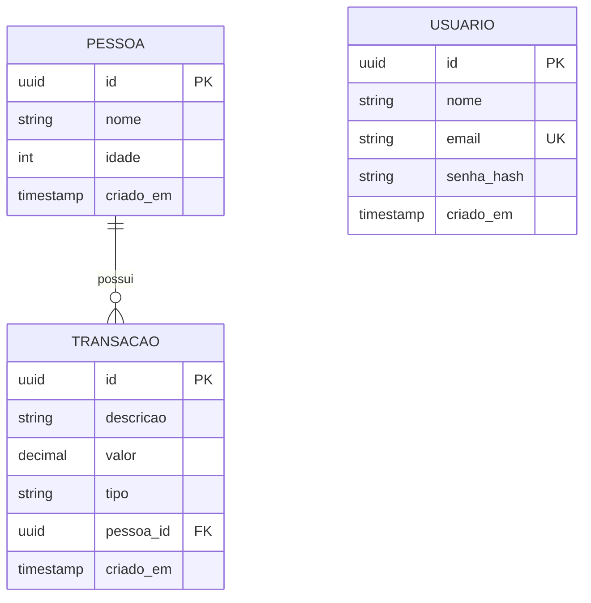

# 04 — Modelagem do Banco de Dados

Banco: **PostgreSQL 16**. Mapeamento: **Entity Framework Core 8** com migrations.

## 1. Modelo Entidade-Relacionamento

**Cardinalidades**

- `PESSOA` 1 : N `TRANSACAO` — uma pessoa possui zero ou muitas transações; cada transação pertence a exatamente uma pessoa, com exclusão em cascata.
- `USUARIO` é uma entidade isolada. A ausência de relacionamento é intencional e está justificada no documento 03.