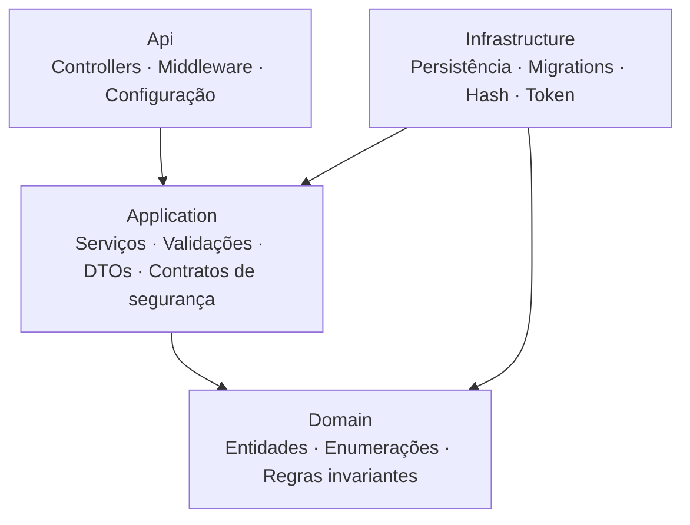
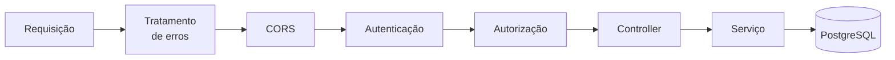
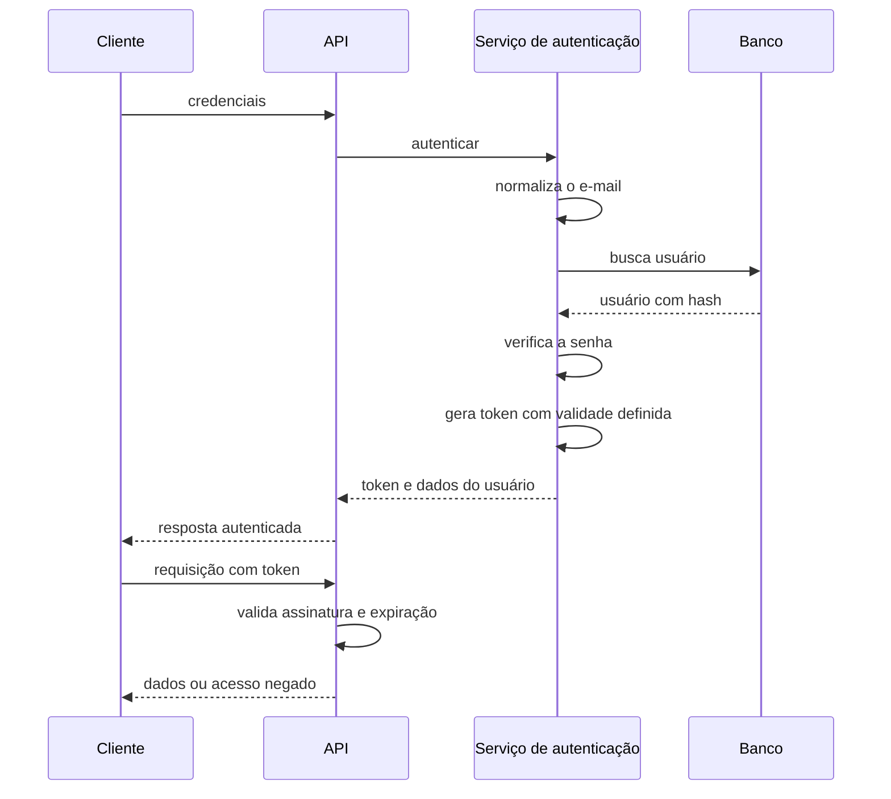
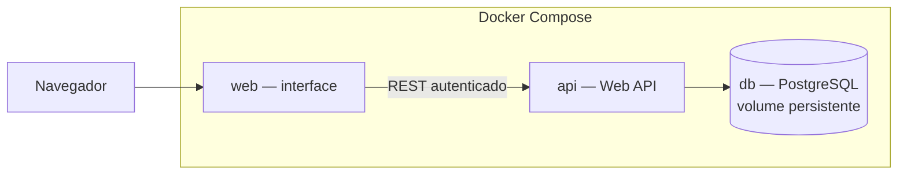

# 05 - Arquitetura

## 1. Estilo arquitetural

**Arquitetura em camadas (Layered / N-tier)** com quatro camadas e a regra de dependência apontando para o domínio: todas as camadas dependem do domínio, e o domínio não depende de nenhuma.

A abordagem incorpora a ideia central de isolar o núcleo de negócio das dependências externas, sem as abstrações que seriam excessivas neste escopo — não há repositórios genéricos, CQRS nem mediador. É a quantidade de estrutura necessária para demonstrar separação de responsabilidades sem introduzir complexidade desnecessária.

## 2. Camadas



| Camada | Responsabilidade | Depende de |
|--------|------------------|------------|
| **Domain** | Entidades, enumerações e regras invariantes | nenhuma |
| **Application** | Casos de uso, validações, DTOs e contratos de segurança | Domain |
| **Infrastructure** | Persistência, migrations, dados iniciais, implementação de hash e token | Domain, Application |
| **Api** | Controllers, middleware de erros, configuração de autenticação e documentação | Application, Infrastructure |

Os controllers são finos: recebem a requisição, invocam o serviço e devolvem a resposta. Não contêm regra de negócio, o que mantém as regras testáveis sem inicializar a API.

**Inversão de dependência na segurança:** as interfaces de hash de senha e geração de token pertencem a `Application`; as implementações concretas pertencem a `Infrastructure`. Assim, a lógica de autenticação não depende diretamente das bibliotecas de criptografia ou de token.

## 3. Pipeline de requisição

A ordem do middleware é normativa.



1. **Tratamento de erros** primeiro, para capturar exceções de qualquer ponto posterior do pipeline.
2. **CORS** antes da autenticação, para que a requisição de verificação prévia não seja rejeitada por ausência de token.
3. **Autenticação** valida o token e monta a identidade.
4. **Autorização** aplica as exigências de acesso.

Inverter autenticação e autorização faz a autorização executar antes de a identidade existir, negando acesso mesmo com token válido.

## 4. Arquitetura de autenticação



### Decisões de segurança

| Decisão | Justificativa | Alternativa descartada |
|---------|---------------|------------------------|
| Token JWT assinado | API sem estado, adequada à separação entre cliente e servidor | Sessão em servidor, que exigiria estado compartilhado |
| Hash com BCrypt | Algoritmo consagrado, com salt por senha e custo ajustável | Hash rápido de propósito geral, vulnerável a força bruta |
| Expiração de 8 horas, sem renovação | Cobre uma jornada de uso sem duplicar a complexidade | Token de renovação, fora do escopo |
| Encerramento no cliente, sem lista de revogação | Manter revogação exigiria consulta a cada requisição | Lista de bloqueio, que contradiz a ausência de estado |
| Armazenamento do token no cliente | Simplicidade e compatibilidade com o fluxo adotado | Cookie restrito exigiria proteção adicional contra requisição forjada |
| Mensagem genérica em falha de autenticação | Impede a descoberta de contas cadastradas | Mensagens distintas, que revelariam e-mails válidos |
| Segredo de assinatura em variável de ambiente | Nunca versionado e substituível por ambiente | Valor fixo no código, que vazaria em repositório público |
| Unicidade de e-mail garantida no banco | Protege contra requisições concorrentes | Validação apenas na aplicação |

### Trade-off do armazenamento do token

O token é mantido no armazenamento local do navegador, o que o expõe caso haja execução de script malicioso. A alternativa mais segura seria um cookie inacessível a scripts, que exigiria proteção contra requisição forjada, configuração de credenciais no CORS e ajustes de domínio entre containers — custo desproporcional ao escopo.

A mitigação adotada é a escapagem automática de conteúdo pela biblioteca de interface, que reduz a superfície de ataque. Em ambiente produtivo, a recomendação seria o cookie restrito com proteção contra requisição forjada.

Documentar o trade-off é parte da decisão: escolher a opção simples sabendo o que se abre mão é engenharia.

### Superfície pública e protegida

| Endpoint | Acesso |
|----------|--------|
| Registro e autenticação | Público |
| Verificação de saúde | Público |
| Documentação da API | Público |
| Perfil do usuário | Protegido |
| Pessoas, transações e totais | Protegido |

A exigência de autenticação é aplicada no nível do controller, com liberação explícita nos endpoints públicos. Negar por padrão é preferível a permitir por padrão: esquecer uma configuração resulta em endpoint protegido demais, nunca desprotegido.

## 5. Organização em projetos

```
backend/src/
├── DomusFinance.Domain/
├── DomusFinance.Application/
├── DomusFinance.Infrastructure/
└── DomusFinance.Api/
```

Projetos separados, em vez de apenas pastas, tornam a regra de dependência verificável pelo compilador: o domínio não referencia nenhum outro projeto, o que impede acoplamento acidental.

## 6. Visão de containers



- Volume nomeado garante a persistência dos dados entre execuções (RNF01).
- A API inicia somente após a verificação de saúde do banco.
- As migrations são aplicadas na inicialização, com nova tentativa em caso de indisponibilidade momentânea.
- O CORS é restrito à origem do cliente.
- O segredo de assinatura é injetado por variável de ambiente.

## 7. Organização do cliente

Estrutura por funcionalidade, com uma camada de serviços isolando o transporte dos componentes.

```
frontend/src/
├── api/          # cliente HTTP e interceptadores
├── auth/         # contexto de sessão, proteção de rotas, autenticação
├── features/     # pessoas, transações, totais
├── components/   # elementos reutilizáveis
└── App.tsx
```

Dois interceptadores concentram a lógica de sessão: um anexa o token às requisições; outro, ao detectar acesso negado, descarta o token e retorna à autenticação. Centralizar esse comportamento evita repetição em cada tela.

## 8. Decisões tecnológicas

| Camada | Escolha | Alternativa descartada |
|--------|---------|------------------------|
| Plataforma | .NET 8, versão de suporte estendido | Versão sem suporte de longo prazo |
| Mapeamento objeto-relacional | EF Core 8 | Micro-ORM, mais verboso para operações básicas |
| Banco | PostgreSQL 16 | Alternativas com licenciamento ou menor aderência a containers |
| Autenticação | Token JWT com BCrypt | Framework de identidade completo, que acrescentaria diversas tabelas e recursos não utilizados |
| Validação | Biblioteca de validação fluente | Anotações no modelo, menos testáveis |
| Interface | React com TypeScript e empacotador moderno | Ferramenta descontinuada |
| Documentação da API | Especificação OpenAPI interativa | Documentação manual |

Sobre a escolha de não adotar um framework de identidade completo: ele resolve confirmação de e-mail, segundo fator, bloqueio por tentativas e papéis, acrescentando várias tabelas ao esquema. Para uma única entidade de usuário com autenticação simples, uma implementação enxuta é mais legível e mais fácil de avaliar — sem que isso signifique implementar criptografia própria, já que o algoritmo de hash continua sendo uma biblioteca consagrada.

## 9. Evolução futura

Registrada como caminho natural, fora do escopo atual:

1. **Isolamento de dados por usuário**, adicionando o vínculo de propriedade nas entidades e filtrando as consultas pelo usuário autenticado.
2. **Renovação de token** com rotação, para sessões longas sem estender a validade do token de acesso.
3. **Papéis e permissões**, diferenciando administração de consulta.
4. **Cookie restrito com proteção contra requisição forjada**, substituindo o armazenamento local.
5. **Recuperação de senha** por e-mail.

## 10. Por que não uma arquitetura mais elaborada

Arquiteturas com interactors, portas e adaptadores ou segregação de comandos e consultas resolvem problemas de sistemas grandes e voláteis que este sistema não apresenta. Um projeto único, por outro lado, funcionaria, mas perderia a demonstração de separação de responsabilidades.

A arquitetura escolhida fica no equilíbrio entre clareza de boas práticas e simplicidade adequada ao escopo.
